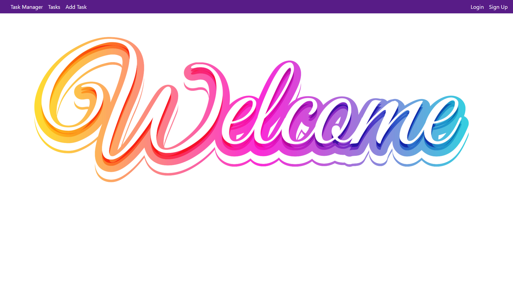
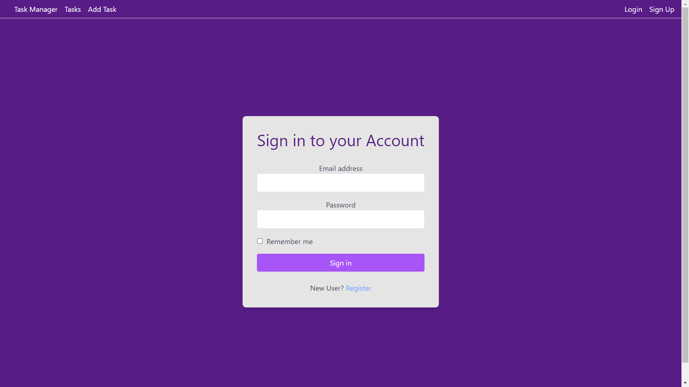
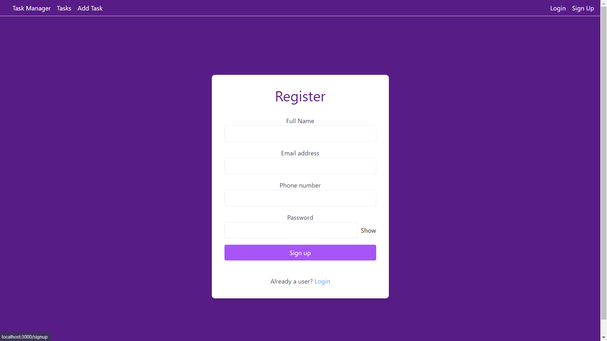
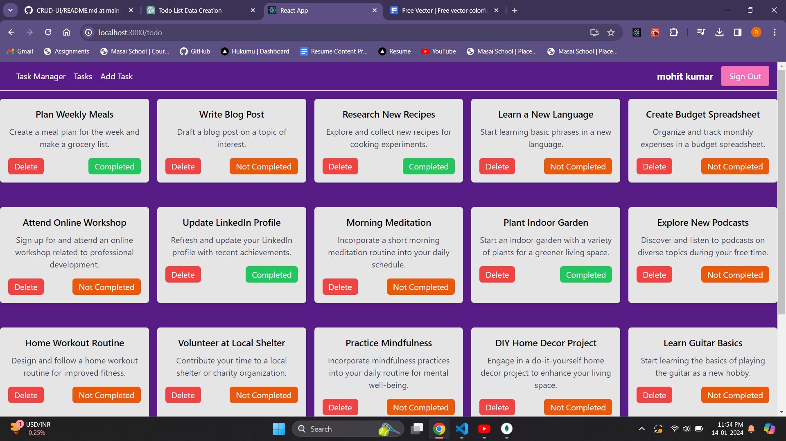
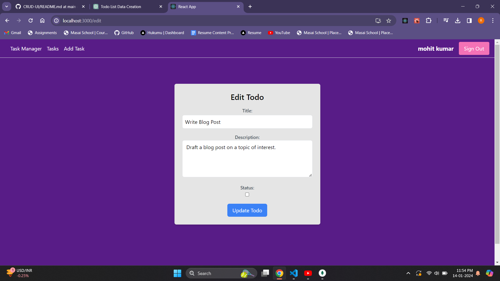
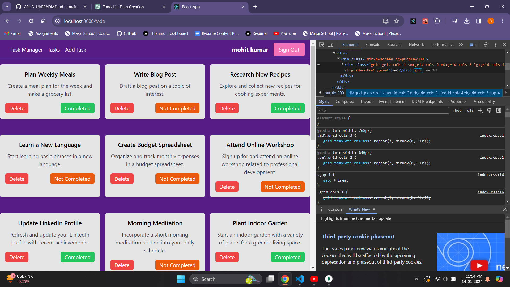
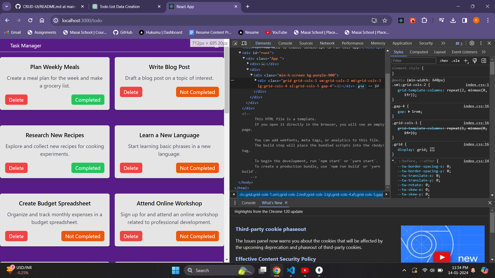
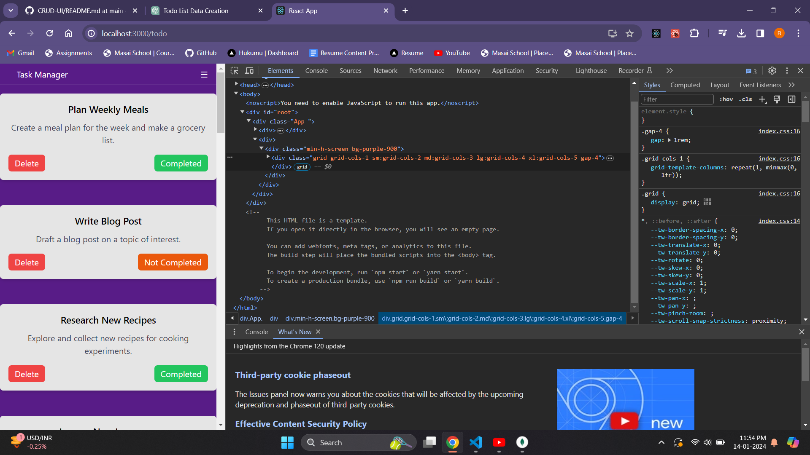

# Todo App

A simple Todo App to help you organize your tasks and stay productive.

## Features

- Add, edit, and delete tasks.
- Mark tasks as completed.
- Responsive design for a seamless experience on various devices.

## Technologies Used

- React.js
- Tailwind CSS

## Getting Started

### Prerequisites

- Node.js (v14 or later)
- npm or yarn
  
### Screenshots

